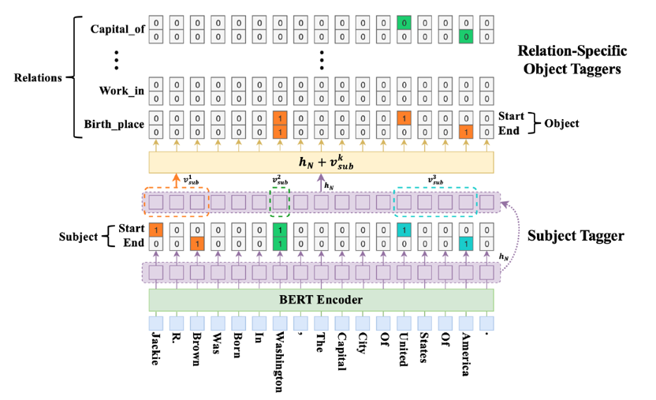

# CasRel_2020

The pytorch implement for CasRel 2020 ACL: A Novel Cascade Binary Tagging Framework for Relational Triple Extraction

### 模型结构
<<<<<<< HEAD
<<<<<<< HEAD

=======

>>>>>>> 091eeca4ac0439edd02a5a44877b890d09dc7e87
=======

>>>>>>> aa1e51b171f5b3c57b27d72eae9218f729bf4712

### 项目环境配置

* Python3.8
* jupyter notebook
* torch           1.6.0+cu10.2
* numpy           1.18.5

